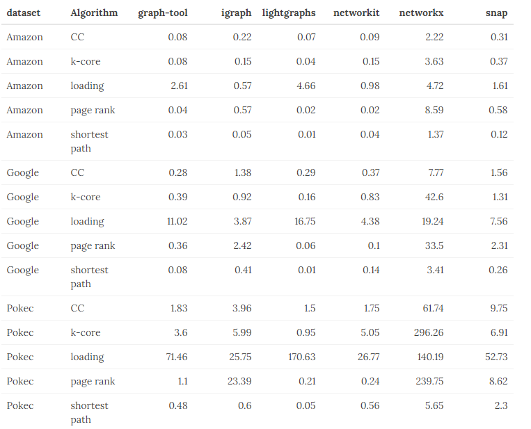

# Benchmark of popular graph / network packages

A comparison of 5 different packages:

- [NetworkX](https://networkx.github.io/), v2.4, Python 3.8
- [graph-tool](https://graph-tool.skewed.de/static/doc/quickstart.html), v2.31, Python 3.8
- [Igraph](https://igraph.org/python/), v0.8.2, Python 3.8
- [NetworKit](https://networkit.github.io/), v6.1.0, Python 3.8
- [SNAP](https://snap.stanford.edu/snap/), v5.0.0, Python 3.7
- [LightGraphs](https://juliagraphs.github.io/LightGraphs.jl/latest/), v2.0-dev, Julia 1.4

For a more detailed description of the process and results, please refer to the following [blog post](https://www.timlrx.com/2020/05/10/benchmark-of-popular-graph-network-packages-v2/).

## Results

The benchmark was run using Google's Compute n1-standard-16 instance (16vCPU Haswell 2.3GHz, 60 GB memory).

Each algorithm was run 100 times on the Amazon and Google dataset and 10 times on the Pokec dataset, with the exception of Networkx.

The median run time is shown in the table below. Due to differences in profiling techniques and code implementation, the results may differ. Please refer to the respective code bases for implementation details.

## Setup

Setup and installation instructions can be found in `setup.md`.

## Data

Datasets are downloaded from https://snap.stanford.edu/data/ and is stored in the data folder. Amazon refers to [amazon0302](https://snap.stanford.edu/data/amazon0302.html), google to [web-Google](https://snap.stanford.edu/data/web-Google.html) and pokec to [soc-Pokec](https://snap.stanford.edu/data/soc-Pokec.html). A `download_data.sh` script is provided in the data folder to automate the download and pre-processing of the SNAP datasets.

## Code

Profiling code are located in the code folder. A particular benchmark code can be run using the helper bash script `run_profiler.sh [profiling code] [dataset path] [number of repetitions] [output path]`. For example, to replicate the igraph benchmark on the amazon dataset with 100 repetitions run `run_profiler.sh code/igraph_profile.py data/amazon0302.txt 100 output/igraph_amazon.txt`.
